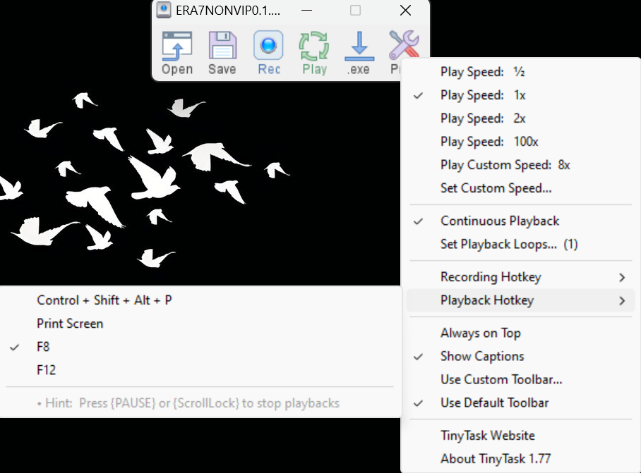
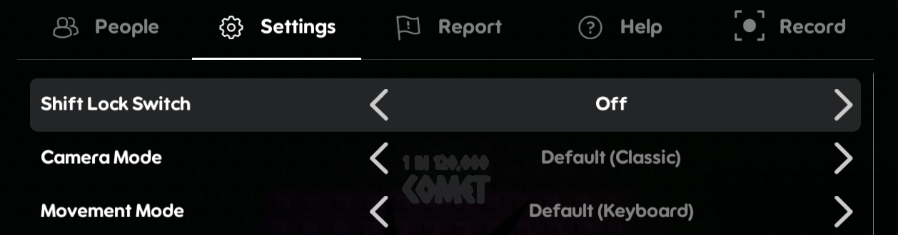

<h2 align="center">🔥 SOL's RNG Era 7</h2>

  <h4 align="center">A simple macro that auto collects potions using TinyTask</h4>

<h3>V0.1 Error</h3>

The [ERA7NONVIPV0.1](https://github.com/ItzKashiii/SOLS-RNG-Era7/tree/main/ERA7-Macro/NONVIP/V0.1) is having some errors, It's like moving slower like its on 5 FPS. So I uploaded a new version for the Macro. You can use the updated version of the macro. [ERA7NONVIP0.2](https://github.com/ItzKashiii/SOLS-RNG-Era7/tree/main/ERA7-Macro/NONVIP/V0.2)

This macro is for user's who really wants to grind some <u>potions</u>. Although I can't guarantee you guys that this macro is 100% but most likely this will really work. This macro is only for **NONVIP**. If you're a NONVIP like me. And if you're a first timer. You should download [TinyTask](https://tinytask.net/) once downloaded I will provide the settings for it below of this info. Once downloaded, Download the [Macro Here](https://github.com/ItzKashiii/SOLS-RNG-Era7/tree/main/ERA7-Macro/NONVIP/V0.1) for those only NONVIP Players. I will also provide a image how to use it. 

These are the steps that is **REQUIRED** inorder to work the macro:

<h3>TinyTask Settings</h3>

1. Play Speed must be on `1x`
2. Turn on the **Continuous Playback**
3. Your Playback Hotkey should be `F8`

<h3>Roblox Settings</h3>

1. Shift Lock Switch must be **OFF**
2. Camera Mode set it to **Default (Classic)**
3. Movement Mode set it to **Default (Keyboard)**

<h3>Player Position</h3>

This part is **REQUIRED** to really work the macro. Follow the image.

Once followed all the steps, Run the macro by pressing `F8`. Enjoy!

<h2>VIP</h2>
Since there's no VIP for my macro, I will make one soon. I mean I would accept it if someone of y'all will give me VIP (MrJhay13) would really appreaciate it.

### Star
If you like this macro, Star the repo! That will help me a lot and Thank you for using it! ^_^

<h2 align="center">**HAPPY GRINDING**</h2>
